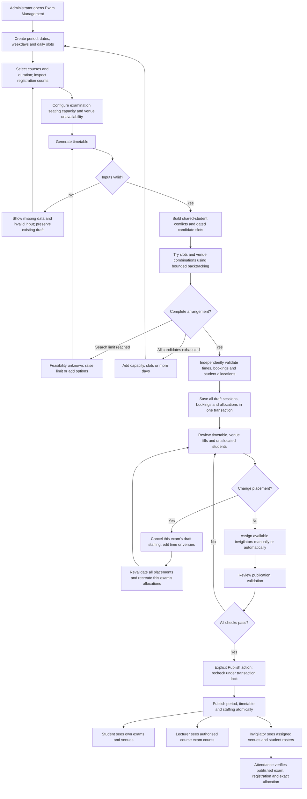

# Examination scheduling: backend changes and frontend integration

> Scheduling update: see [automatic academic year and required seats](scheduling-automatic-defaults-integration.md). Omit academicYear from period setup; display registration counts as required seats.

This change implements the backend workflow only. No frontend files were changed.
Administrators can create one examination period per academic year/semester/exam
type, select courses, generate a draft with exam-specific student allocations,
review or move examinations, assign invigilators, validate, and publish.

For final dashboard-by-dashboard frontend contracts, see the
[Examination Dashboard Integration guides](dashboard-integration/README.md).
The earlier [dashboard integration map](examination-scheduling-dashboard-integration.md)
remains a quick overview.

## Workflow flowchart



Generation never publishes. A complete draft does **not** guarantee staffing.
Published managed periods are locked against placement, allocation and staffing
edits. There is no unpublish or direct post-publication edit endpoint. A separate,
approval-controlled amendment workflow can move an eligible future exam; show
published records read-only except for that explicit proposal/review/apply flow.

## What changed and what was reused

| Area | Behaviour |
| --- | --- |
| Period setup | New `examination_period`, daily slot templates and selected course durations. Dates are configurable; weekday numbers use ISO Monday=1 through Sunday=7. |
| Existing exam model | `exam_session` gains nullable `period_id` and `schedule_published`. Legacy sessions retain their identities and published visibility. Operational status remains `SCHEDULED`, `IN_PROGRESS`, or `COMPLETED`. |
| Venue bookings | Existing `exam_venue` remains the exam/venue relationship. One venue per overlapping interval; a course can occupy several venues. |
| Student allocations | Existing student/exam primary key remains. Allocation rows reference the exam's booked venue, and writes must match a course/year/semester registration. |
| Capacity | New `venue.examination_capacity`; normal `capacity` is not copied automatically. Unconfigured venues are excluded from automated generation. |
| Unavailability | New `venue_unavailability` records institution-local start/end intervals and reasons. Existing exam bookings, including other drafts, also reserve venues. |
| Lecturer counts | Count only registered students with a booking for the selected exam. Stale rows are excluded and reported as `invalidAllocationRecords`. Added unallocated and attended counts. |
| Publication | Independent revalidation, registration coverage, venue capacity, interval clashes and active invigilator staffing are checked in the publishing transaction. |
| Access control | Existing JWT authorities and lecturer course ownership are reused. New administration APIs require `ADMINISTRATOR`. Attendance reads are scoped to the authorised course or assigned venue. |
| Scheduling authority | Any active Administrator can manage every period and complete its scheduling and amendment workflow. No coordinator assignment, scheduling-lead permission or second-administrator approval is required. Changes and approvals are audited. |
| Change requests | Administrators and course lecturers can submit review requests for published managed exams. Requests record a proposal and decision only; they never alter the timetable. |
| Published amendments | An Administrator proposes and explicitly approves or rejects an eligible future exam move, then separately applies an approved amendment. Current placements, allocations, capacity, conflicts and duties are revalidated. |
| Notifications | Applied amendments create in-application inbox messages for affected students and staff. No SMTP or external email is sent; delivery can be retried without reapplying the amendment. |
| Attendance | Preserves QR token verification and verification-method support. Requires current course registration, a published exam, the specific exam allocation and the exact assigned venue. Wrong-venue check-in is now rejected instead of creating a `WRONG_VENUE` attendance row. Historic wrong-venue records remain readable. No override endpoint was added. |

The reported one-versus-seven issue was **not** confirmed against live records.
The old service already queried allocations by exam ID, but trusted stale
allocation rows. The phase 12 development seed also explicitly registers seven
computing students for every listed computing course. No live registrations were
edited to force a count of one. The new audit API makes inconsistent historical
rows visible for correction.

## Rules and assumptions

- A cycle is `(academicYear, semester, examType)`. Exactly one managed period is
  allowed for that cycle; each selected course has one generated exam.
- Matching `student_registration` rows are the source of examination eligibility.
  This feature adds no payment, grade, programme-year or disciplinary eligibility
  policy. Maintain the registration source to reflect institution-approved eligibility.
- School is a catalogue filter. Students sharing a course registration clash even
  across schools or programmes.
- Timezone: `INSTITUTION_TIMEZONE`, default **Africa/Lusaka**. Configure it before
  creating periods. Existing local timestamp operations and QR expiry conversions
  use that zone. Scheduling rejects a changed configuration that disagrees with
  saved periods; do not reinterpret existing local timestamps in another timezone.
- All durations and overlap checks use full intervals. End-to-start adjacency is
  allowed. Automatic starts use the configured daily slot start times; manual starts
  may be later within a slot, provided the whole duration fits.
- Search tries alternative slots and venue subsets deterministically, prioritising
  exams with fewer available slots, more shared-student conflicts and more students.
  Search is limited to 100 selected courses and 1,000,000 search steps. Recommended
  demonstration limit: 100,000. Up to 12 daily slots and a 367-day inclusive period.
- `NO_FEASIBLE_ARRANGEMENT` means the finite configured automatic placement grid was
  exhausted. `SEARCH_LIMIT_REACHED` does not prove infeasibility.
- Staffing reuses one active invigilator per 50 allocated students, minimum one per
  booked venue. An invigilator cannot supervise two simultaneous venues, even for
  the same exam.
- Regeneration replaces only a period's unpublished generated draft. Cancel its
  assignments first. Attendance, incidents, reports and started sessions block
  replacement. Failure leaves the previous draft and revision intact.
- Any active Administrator may edit any draft period, review requests, propose and
  apply amendments, view audit history, and retry failed notification delivery. No
  coordinator assignment, scheduling-lead permission or different administrator
  approval is required.
  Routine amendments are limited to future, scheduled exams with no attendance,
  incident or generated-report records. Started/completed exams need a separately
  defined exceptional process.
- An amendment does not change course, cycle, registration membership or attendance
  history. It may change date/time, venues, student-to-venue allocations and published
  invigilator duties. Omitted venue/duty lists retain the current set; when changing
  venues, provide duties for the proposed venues. The apply operation revalidates
  current capacity, slots, conflicts and staffing, records before/after snapshots,
  increments the period revision and queues notifications.
- Existing same-course/same-cycle sessions outside the period block generation;
  the system does not guess whether those records should be adopted or replaced.

## API conventions

Base URL below: `/api/admin/examination-periods`. Send the existing bearer token.
All endpoints in this section require `ADMINISTRATOR`.

The response wrapper is unchanged:

```json
{"success":true,"message":"Examination period","data":{}}
```

**Requests use camelCase.** Period/detail records come from JDBC and use the
documented **snake_case database field names**. Typed result envelopes and legacy
DTOs use camelCase. Do not blindly apply a naming conversion to both shapes.
Read timestamps as returned and display examination dates/times in the period's
timezone; do not reinterpret local exam times as UTC.

| Method and path | Purpose / body |
| --- | --- |
| `GET /` | List periods with `period_id`, cycle fields, dates, `timezone`, `status`, `revision`, `published_at`. |
| `POST /` | Create a period; setup body below. Returns full detail, revision 0. Multiple drafts may share the same academic year, semester and exam type. |
| `DELETE /{id}?revision=0` | Delete one unpublished draft period and its draft schedule. Requires the latest revision; published periods and periods with operational or review history are retained. |
| `GET /{id}` | Full review detail, including slots, courses, exams, bookings, allocations, unallocated students and assignments. |
| `PUT /{id}?revision=0` | Replace period setup before generation, using the same setup body. Reset an existing draft first. |
| `GET /{id}/courses?schoolId=1` | Active courses and matching `eligible_students`. School filter is optional. |
| `PUT /{id}/courses` | Replace selected courses and durations before generation. Body: `revision` and `courses`. |
| `POST /{id}/generate` | Body: `{"revision":1,"searchLimit":100000}`. Returns generation outcome and current full detail. |
| `PUT /{id}/exams/{session}/placement` | Body: `revision`, `examDate`, `startTime`, `venueIds`. Reallocates students deterministically and revalidates the whole draft. |
| `POST /{id}/reset-draft` | Body: `{"revision":2}`. Explicitly clears replaceable generated sessions/allocations; preserves period and course selection. |
| `POST /{id}/auto-assign-invigilators` | Generates draft staffing for this period, reusing existing conflict/workload logic. Returns per-exam results and `understaffedVenueIds`; may report shortages. |
| `POST /{id}/invigilators` | Body: `{"examSessionId":12,"venueId":3,"staffId":7}`. Create one draft duty; no curriculum selection object is needed here. |
| `GET /{id}/history` | Scheduling audit records for the period, including actor, entity, action and before/after values where available. |
| `GET /{id}/validation` | `data: {"valid":false,"problems":["..."]}`. Shows publication blockers, including missing staffing. |
| `POST /{id}/publish` | Body: `{"revision":2}`. Revalidates and publishes period, exams and staffing together. |
| `GET /venues` | `venue_id`, `venue_name`, `building`, classroom `capacity`, and nullable `examination_capacity`. |
| `PUT /venues/{venue}/capacity` | Body: `{"examinationCapacity":60}`. Rejects reductions below existing allocations. |
| `GET /venue-unavailability` | List recorded unavailable intervals. |
| `POST /venues/{venue}/unavailability` | Body: `startsAt`, `endsAt`, `reason`. Rejects overlap with an existing exam booking. |
| `GET /allocation-audit` | Historical rows needing correction: `computer_number`, `exam_session_id`, `venue_id`, `course_code`, `issue`. |

Drafts can share a cycle, but generation still rejects a course already represented
by a legacy exam or an exam in a published period. Other draft periods do not
reserve the cycle; their existing exam times and venue bookings are still considered
when checking a proposed placement.

### Staff requests and post-publication amendments

The change-request API is rooted at `/api/examination-change-requests`.
Administrators and lecturers may submit requests; an active lecturer must own the
course and can access only their own requests for published exams. An administrator
can see and decide all period requests. These requests are a review record only and
do not change exam arrangements.

| Method and path | Purpose / body |
| --- | --- |
| `POST /api/examination-change-requests` | Submit `{ "periodId": 4, "courseCode": "DEMO101", "examSessionId": 12, "proposedChange": "...", "reason": "..." }`. `examSessionId` may be `null`; when supplied it must belong to the selected period and course. |
| `GET /api/examination-change-requests?periodId=4` | List requests visible to the caller. JDBC request fields are snake_case. |
| `POST /api/examination-change-requests/{requestId}/decision` | Administrator records `{ "status": "APPROVED", "decision": "..." }` or `REJECTED`. This does not apply a timetable change. |
| `GET /api/examination-change-requests/capacity-lecturers?periodId=4&courseCode=DEMO101` | Administrator-only list of assigned lecturers (`staff_id`, `full_name`, `email`) for preparing a capacity enquiry. |
| `POST /api/examination-change-requests/capacity-draft` | Administrator-only body: `{ "periodId": 4, "courseCode": "DEMO101", "venueId": 3, "lecturerStaffId": 7 }`. Returns a copyable `{ "to", "subject", "body", "deliveryStatus": "DRAFT_ONLY", "sendAvailable": false }`; no email is sent and no capacity is changed. |

Published timetable amendments are rooted at
`/api/admin/examination-periods/{period}/amendments`. All routes require the
administrator authority. Proposals require a published, future `SCHEDULED` exam, the current period
revision, and no attendance, incident or generated-report records. The proposed
date/time must fit an allowed slot and pass full timetable validation.

| Method and path | Purpose / body |
| --- | --- |
| `GET /api/admin/examination-periods/{period}/amendments` | List the period's proposals, including their venue, allocation and duty scope. |
| `POST /api/admin/examination-periods/{period}/amendments` | Administrator proposes `{ "examSessionId": 12, "revision": 3, "examDate": "2030-01-08", "startTime": "11:00", "reason": "...", "venueIds": [3,4], "duties": [{"venueId":3,"staffId":7},{"venueId":4,"staffId":8}] }`. `venueIds` and `duties` are optional when retaining the existing sets. Each duty uses `venueId` and `staffId`. |
| `POST /api/admin/examination-periods/{period}/amendments/{id}/decision` | Administrator records `{ "status": "APPROVED", "reason": "..." }` or `REJECTED`, including the proposal's author. Approval rechecks the current revision and scope; it does not change the timetable. |
| `POST /api/admin/examination-periods/{period}/amendments/{id}/apply` | Administrator separately applies an approved proposal. Revalidates again; if relevant data changed, it fails without applying and the proposal must be reviewed against current data. Apply increments period revision and creates the audit snapshots and inbox notifications. |
| `GET /api/admin/examination-periods/{period}/amendments/{id}/notifications` | Inspect notification rows and delivery state. |
| `POST /api/admin/examination-periods/{period}/amendments/{id}/retry-notifications` | Administrator retries delivery for an applied amendment only; it does not apply the amendment again. |

`GET /api/examination-notifications` returns the authenticated student's or staff
member's available inbox messages. `POST /api/examination-notifications/{id}/read`
marks only a message belonging to that account as read. Notifications are created
for the affected students, current invigilators, prior invigilators, and course
lecturers. Delivery status is `PENDING`, `AVAILABLE` or `FAILED`; retry only
re-attempts inbox delivery. It never sends external email.

Legacy databases may retain `coordinator_staff_id` and scheduling-lead records for
history, but they do not affect authorization. The period response and change-request,
amendment and notification endpoints return their normal
`{"success":true,"message":"...","data":...}` envelope. JDBC-backed request,
amendment, audit and notification records use snake_case fields unless otherwise
noted above. Request submission/decision does not increment the period revision.
Amendment revision increments when the approved
amendment is applied, not when it is proposed or reviewed.

Example setup (Monday–Friday, change these dates for the intended cycle):

```json
{
  "name": "Final examinations",
  "semester": 1,
  "examType": "FINAL",
  "startDate": "2030-01-07",
  "endDate": "2030-01-11",
  "daysOfWeek": [1, 2, 3, 4, 5],
  "slots": [
    {"startTime": "09:00", "endTime": "11:00"},
    {"startTime": "11:00", "endTime": "13:00"}
  ]
}
```

Example selection:

```json
{
  "revision": 0,
  "courses": [
    {"courseCode": "DEMO101", "durationMinutes": 120},
    {"courseCode": "DEMO102", "durationMinutes": 120},
    {"courseCode": "DEMO201", "durationMinutes": 120},
    {"courseCode": "DEMO301", "durationMinutes": 120}
  ]
}
```

Example placement change:

```json
{"revision":2,"examDate":"2030-01-08","startTime":"11:00","venueIds":[3,4]}
```

Use IDs returned by the server; IDs in examples are placeholders. Courses and
venues are not selected by their array position. Duration stays as selected for
the course; changing it requires resetting the draft and updating the selection.

### Detail shape and generation outcomes

`GET /{id}` has the period fields plus:

- `slots`: `day_of_week`, `start_time`, `end_time`.
- `courses`: `course_code`, `course_name`, `duration_minutes`, `eligible_students`.
- `exams`: exam fields including `exam_session_id`, `course_code`, date/times,
  `period_id`, `schedule_published`, `registered_students`, `allocated_students`.
- `bookings`: `exam_session_id`, `venue_id`, `venue_name`, `examination_capacity`,
  `allocated_students`.
- `allocations`: `computer_number`, `exam_session_id`, `venue_id`, `full_name`.
- `unallocatedStudents`: `course_code`, `computer_number`; present even before generation.
- `assignments`: existing assignment fields including exam/venue/staff IDs and `assignment_status`.

Generation returns `data: {"result": {...}, "period": {...}}`. `result` contains
`outcome`, `placements`, `unresolvedCourses`, `searchSteps` and `problems`.

| Outcome | UI action |
| --- | --- |
| `COMPLETE` | Show the saved draft and a separate staffing/review step. `success` is true. |
| `INVALID_INPUT` | Display missing registrations, capacities or duplicate existing cycle sessions. |
| `NO_FEASIBLE_ARRANGEMENT` | Offer additional capacity, daily slots or a longer period. |
| `SEARCH_LIMIT_REACHED` | Explain that feasibility is unknown; allow a larger limit or more scheduling options. |

These algorithm outcomes use HTTP 200; the last three have `success:false` **with
useful `data`**. Preserve that data in the API client instead of discarding every
unsuccessful envelope. Request validation errors use 400; forbidden access 403;
stale revisions, locked periods, publication blockers and integrity conflicts 409.
An infrastructure failure remains an error; do not render it as infeasibility.

Each setup, selection, successful generation, placement, reset and publication
increments `revision`. Use the latest returned revision. Staffing, capacities,
registrations and unavailable intervals are rechecked at publication even though
they do not all increment the period revision. Refresh the review after staffing
changes. Never auto-retry a 409 with a guessed revision.

## Reuse these existing frontend integrations

- Existing navigation can expose period setup, course selection, timetable,
  allocation, staffing and publication as tabs on Exam Management.
- `GET /api/admin/invigilator-assignments/exam-sessions/{exam}/staffing` provides
  required staffing and available staff. Existing assignment list and cancellation
  endpoints remain available. Cancellation is
  `POST /api/admin/invigilator-assignments/{exam}/{venue}/{staff}/cancel`.
- For managed periods, use the **period publication endpoint**, not the old
  assignment-only publish endpoint. The latter rejects managed sessions.
- `GET /api/exams` still returns camelCase DTOs and now adds `periodId` and
  `schedulePublished`. Lecturers only receive published exams for their courses.
  Administrators can see drafts; use the period API for the complete review.
- `GET /api/allocation/exam-session/{exam}` retains existing fields and adds
  `unallocatedStudents`, `attendedStudents`, `invalidAllocationRecords`.
  Example: registered=1, allocated=1, unallocated=0, attended=0 before attendance.
- `GET /api/dashboard/lecturer` adds those aggregate counts and an `examinations`
  array of per-exam statistics. Totals represent student/exam participations, not
  unique people across every course. `?examSessionId=` remains the specific-exam view.
- `GET /api/student/examinations` and examination-pass generation exclude drafts.
  Existing active programme enrolment and account/pass requirements are preserved.
- `GET /api/invigilator/assignments` excludes drafts. New roster endpoint:
  `GET /api/invigilator/assignments/{exam}/{venue}/students`. Returns only registered
  allocated students for that published duty, including `attendance_status`.
- Attendance list and summary endpoints now enforce lecturer course ownership or
  invigilator venue assignment. Invigilator venue reads no longer expose other
  venues merely because the user has the invigilator role.
- Recorded attendance count includes present, late and historic wrong-venue
  attendance; excludes recorded absences and stale/ineligible allocations.

Use clear loading and empty states for each tab. Show blockers before Publish and
also display any fresh server-side publication error. Disable duplicate submits.
Before reset/regeneration, show the exams and allocation counts that will be
replaced. Published records should show their date/time, assigned venues and a
locked state. Surface `invalidAllocationRecords` to an administrator rather than
silently displaying inconsistent totals.

## Migration and deployment handoff

The implementation has not been deployed and the configured application database
has not been migrated or seeded. `.env` was not changed.

1. Back up and test a copy of the existing database. It must already have the
   academic catalogue, programme-course mappings, invigilator workflow columns,
   and migrations through V31 (or their matching Supabase phases).
2. Apply `src/main/resources/db/migration/V32__examination_scheduling.sql` **once,
   in a single transaction**. For a PostgreSQL CLI connection:

   ```bash
   psql "$SCHEDULING_DATABASE_URL" -v ON_ERROR_STOP=1 --single-transaction \
     -f src/main/resources/db/migration/V32__examination_scheduling.sql
   ```

   This variable should contain a PostgreSQL connection URI for the intended test
   database, not the application's JDBC-prefixed URL. In Supabase SQL Editor,
   surround the entire V32 script with `BEGIN;` and `COMMIT;`.
3. To enable the staff coordination, change-request, notification and approved
  amendment workflows described above, apply V33 through V37 once each, in order
  and in a transaction per migration: `V33__scheduling_coordination.sql`,
  `V34__scheduling_change_requests.sql`, `V35__published_time_amendments.sql`,
  `V36__scheduling_integrity_hardening.sql`, then
  `V37__approved_placement_amendments.sql` and
  `V38__administrator_owned_scheduling.sql`. V38 makes Administrator the sole
  scheduling authority while retaining legacy coordinator/lead rows as inert
  history. Each depends on the preceding schema;
  do not skip or reorder them. Back up and test the complete sequence on a copy first.
4. Query `SELECT * FROM public.exam_allocation_audit;` or the audit API. The new
   exam/venue foreign key is `NOT VALID` for historical rows: new writes are checked
   immediately, but existing ambiguous records are retained. Correct each row only
   after verifying its actual exam registration and booking. Do not infer course
   ownership from a shared venue or delete history wholesale.
5. Once audited rows are resolved, validate the historical foreign key explicitly:

   ```sql
   ALTER TABLE public.student_venue_allocation
     VALIDATE CONSTRAINT allocation_exam_booking_fk;
   ```

6. Configure verified examination seating capacities through the new endpoint.
   Legacy `capacity` remains available; it is only used as the legacy display
   fallback when no examination capacity exists, never for new generation.
7. Start the updated backend with the institution timezone and integrate the APIs.

Flyway is currently disabled in `application.properties`. The repository also
contains two existing `V27__...` migrations. **Do not simply enable Flyway against
the existing database**: reconcile its pre-existing migration history/versioning
first. V32 through V37 are provided for the existing manual SQL workflow; this
change does not rename historical migrations or run earlier destructive reset scripts.

Concurrency uses the existing PostgreSQL transaction advisory lock `(741902,1)`
for scheduling and staffing. Statement triggers also acquire it for relevant
direct database writes. Allocation eligibility/capacity and booking overlap are
checked in the database; registration/placement/allocation edits to published
managed periods are blocked. The service independently validates the full result
under the same lock before saving or publishing.

## Development demonstration

Use a **separate development database** after V32. In one SQL session:

```sql
SET app.allow_demo_seed = 'true';
SET app.demo_start_date = '2030-01-07'; -- configurable Monday; set before first run
```

Then run `supabase/phase_24_scheduling_demo.sql`. In `psql` use `\i` or pass the
`SET` commands and `-f` in the same invocation. Without the explicit development
opt-in it refuses to run. Default dates use the first Monday in January two years
from the current year. Reruns reuse the original demo reservation date and insert
only missing demo rows. It creates no managed period automatically.

| Scenario | Demo data / action |
| --- | --- |
| One-student count | Select `DEMO101`: only `SD000001` is registered. Demo lecturer owns this course. |
| Simultaneous independent exams | `DEMO101` and `DEMO102` have no shared students; their venues may differ at the same time. |
| Shared-student clash | `DEMO101` and `DEMO201` share `SD000001` and must not overlap. |
| Multiple venues | `DEMO301` has five students; each demo venue has examination capacity three. |
| Venue reuse / existing booking | `DEMOEXT` already books Room 1 Monday 09:00–11:00 for three unrelated students. It can be reused afterwards. Do not select `DEMOEXT` for generation. |
| Unavailability | Room 2 is unavailable Tuesday 09:00–11:00. |
| Insufficient capacity | Add `DEMO999` (20 students) when only the two demo rooms have configured examination capacities. More slots cannot solve a per-exam seating shortfall of 20 versus 6. |
| Invigilator conflict | Invigilator 1 already supervises `DEMOEXT`. Attempt to assign them to a simultaneous exam in Room 2: the request is rejected. Automatic staffing selects available staff. |

Create a Monday–Friday period using the seed's printed dates; the academic year comes from the latest student registrations;
choose daily slots 09:00–11:00 and 11:00–13:00. Select `DEMO101`, `DEMO102`,
`DEMO201`, `DEMO301`, each for 120 minutes; generate, review, auto-assign, validate,
then publish. Demo identities have no new login passwords and no fabricated face
images. Use the application's existing activation/setup process if you need to
log in as those demo users; administrator API review works without activating them.

## Verification and practical limits

Automated checks cover deterministic backtracking, exhaustive versus limited
search, split venues, shared-student and reservation intervals, invalid inputs,
duplicate allocation rejection, repeated generation, stale revisions, rollback,
manual movement, publication blockers, staffing conflicts, role boundaries,
attendance eligibility, draft hiding, migration preservation and concurrent writes.

Unit tests without the configured application database:

```bash
./mvnw test -Dtest='!FourthApplicationTests,!SchedulingHttpFlowTest'
```

`SchedulingPostgresTest` is opt-in (`-Dscheduling.it=true`). It requires a disposable
PostgreSQL cluster at `127.0.0.1:55439`, with the operating-system username able to
create databases. It creates/drops only uniquely named `scheduling_it_*` databases.
`SchedulingHttpFlowTest` is separately opt-in (`-Dscheduling.http=true`) and requires
the full seeded disposable `scheduling_full_smoke` database at that same port.
Use a fresh copy for each HTTP run: the test intentionally publishes its period.
Override Spring datasource/JWT properties with local test values; never point
these workflow tests at the application's production connection.

The HTTP check exercises JWT role enforcement, complete generation, blocked early
publication, automatic staffing, successful publication, student visibility,
the lecturer's 1/1/0 counts and the invigilator roster. The older SQL dump requires
the existing catalogue/assignment phases to be applied before testing V32; it is
not itself a current schema snapshot.

The search and review APIs target a small demonstration dataset and return full
review lists without pagination. They do not optimise travel time, preferred
lecturer slots, workload fairness for exam dates, or minimum gaps beyond preventing
overlap. Published scheduling records remain locked except for the approval-controlled
amendment workflow documented above. There is no unpublish or exceptional process for
started/completed exams or exams with attendance, incidents or generated reports.
